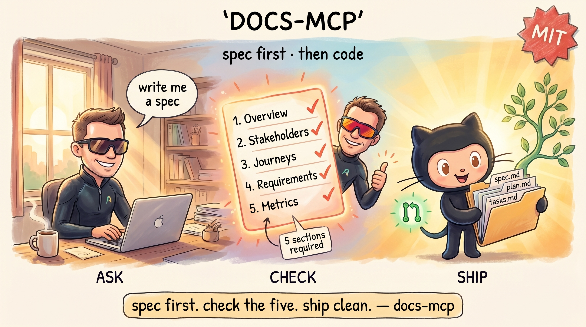

# docs-mcp

A small helper for Claude Code and Cursor that writes feature documentation to GitHub. Spec first, code later.



---

## Quick install

You need **Node.js 20+**.

```bash
git clone https://github.com/openpoem/docs-mcp.git
cd docs-mcp
npm install && npm run build
```

Add this to `~/.claude/mcp.json`:

```json
{
  "mcpServers": {
    "docs-mcp": {
      "command": "node",
      "args": ["/absolute/path/to/docs-mcp/dist/stdio.js"],
      "env": {
        "GITHUB_TOKEN": "ghp_...",
        "GITHUB_OWNER": "your-org",
        "GITHUB_REPO": "your-repo"
      }
    }
  }
}
```

Restart Claude Code. Done.

For Cursor it's the same, but in `.cursor/mcp.json`.

---

## What does it do?

You ask Claude to write a spec for a new feature. Claude creates three files in your GitHub repo:

```
.docs/features/
└── invoice-upload/
    ├── invoice-upload_spec.md      ← what we're going to build
    ├── invoice-upload_plan.md      ← how we'll approach it
    └── invoice-upload_tasks.md     ← step-by-step list
```

The server commits this on a new branch. Claude can then open a Pull Request for review.

---

## The five tools Claude gets

| Tool | What it does |
|---|---|
| `list_feature_docs` | Lists all features in `.docs/features/` |
| `read_feature_doc` | Reads a spec, plan or tasks file |
| `validate_spec` | Checks whether a spec is complete (without saving) |
| `write_feature_doc` | Writes a spec/plan/tasks to a new branch |
| `create_docs_pr` | Opens a Pull Request |

---

## The spec check

A spec is only saved if these five headings are present, in this exact form:

```markdown
## 1. Overview
## 2. Users & Stakeholders
## 3. User Journeys
## 4. Experience Requirements
## 5. Success Metrics
```

Missing one? The server refuses and tells you which ones are missing. No half-specs land in your repo.

> **Note:** the check is literal. Writing `## Overview` without the number will fail. Stick to the pattern above and it works.

Writes always go to a new branch — `docs/{feature-name}-{timestamp}`. Never directly to `main`.

---

## What docs-mcp does and doesn't do

docs-mcp does three things:

1. **ASK** — you ask Claude for a spec, plan and tasks.
2. **CHECK** — the server checks whether the spec has the five required headings.
3. **SHIP** — commit to a new branch, optionally a PR.

After that, the server stops. Building, deploying, or measuring whether the feature did what the spec promised — that's done with your usual tools.

**Sister tool: spec-score-mcp**

Before you write a spec to GitHub, you can have it scored by [spec-score-mcp](https://github.com/openpoem/spec-score-mcp) first. It scores on 4 axes (completeness, clarity, constraints, specificity) and tells you whether the spec is sharp enough to execute.

- **spec-score-mcp** checks whether the **content** holds up — is the spec sharp?
- **docs-mcp** checks whether the **form** holds up — are the 5 headings there? — and writes to GitHub.

Workflow: score with spec-score-mcp until 'SHIP IT', then write to GitHub with docs-mcp.

---

## Settings

| Setting | Required | Default | What is it? |
|---|---|---|---|
| `GITHUB_TOKEN` | yes | — | Personal GitHub token with `repo` scope. Create one via GitHub → Settings → Developer settings. |
| `GITHUB_OWNER` | yes* | — | Owner of the repo. For `github.com/acme/widgets` that's `acme`. |
| `GITHUB_REPO` | yes* | — | Name of the repo. For `github.com/acme/widgets` that's `widgets`. |
| `GITHUB_REPOSITORY` | yes* | — | Alternative: `acme/widgets` as a single string. |
| `GITHUB_DEFAULT_BRANCH` | no | `main` | Main branch — sometimes `master`. |
| `DOCS_PATH` | no | `.docs/features` | Where in your repo the feature folders go. |
| `DOC_FILENAME_MODE` | no | `prefixed` | `flat` → `spec.md`. `prefixed` → `invoice-upload_spec.md`. |

*Provide either `GITHUB_OWNER` + `GITHUB_REPO`, or `GITHUB_REPOSITORY`.

---

## Does it work?

```bash
echo '{"jsonrpc":"2.0","id":1,"method":"tools/list","params":{}}' | node dist/stdio.js
```

You'll get back JSON with the five tool names. Works? Then everything is set up correctly. Doesn't work? Usually `GITHUB_TOKEN` isn't set or the path in `mcp.json` is wrong.

---

## What's in the folder

| File | What it is |
|---|---|
| `stdio.ts` | The main program. Talks to Claude via stdin/stdout. |
| `github.ts` | Calls the GitHub API to read, write, and create PRs. |
| `validators.ts` | Checks whether a spec has the five required headings. |
| `package.json` | Tells Node which version and which build tools to use. |
| `tsconfig.json` | TypeScript-to-JavaScript settings. |
| `dist/` | Created after `npm run build`. Contains the JavaScript that Claude runs. |
| `node_modules/` | Created after `npm install`. Only TypeScript and Node types — not needed at runtime, only for building. |

No external runtime dependencies. Node 20+ has `fetch` and `readline` built in, and that's all the server uses.

---

## What it doesn't do

Honest about the limits:

- **The spec check is literal.** `## 1. Overview` works. `## Overview` or `# 1. Overview` doesn't. No flexibility in the headings.
- **Only specs are validated.** Plans and tasks can be anything.
- **No content scoring.** If the 5 headings are there, the spec passes — even if the content is weak. For content scoring: use [spec-score-mcp](https://github.com/openpoem/spec-score-mcp) first.
- **No post-launch measurement.** docs-mcp stops after SHIP. Whether the feature did what the spec promised is up to you to measure.
- **No content deduplication.** Writing the same spec twice = two branches.

---

## License

MIT License

Copyright (c) 2026 Ron Koldeweid

Permission is hereby granted, free of charge, to any person obtaining a copy of this software and associated documentation files (the "Software"), to deal in the Software without restriction, including without limitation the rights to use, copy, modify, merge, publish, distribute, sublicense, and/or sell copies of the Software, and to permit persons to whom the Software is furnished to do so, subject to the following conditions:

The above copyright notice and this permission notice shall be included in all copies or substantial portions of the Software.

THE SOFTWARE IS PROVIDED "AS IS", WITHOUT WARRANTY OF ANY KIND, EXPRESS OR IMPLIED, INCLUDING BUT NOT LIMITED TO THE WARRANTIES OF MERCHANTABILITY, FITNESS FOR A PARTICULAR PURPOSE AND NONINFRINGEMENT. IN NO EVENT SHALL THE AUTHORS OR COPYRIGHT HOLDERS BE LIABLE FOR ANY CLAIM, DAMAGES OR OTHER LIABILITY, WHETHER IN AN ACTION OF CONTRACT, TORT OR OTHERWISE, ARISING FROM, OUT OF OR IN CONNECTION WITH THE SOFTWARE OR THE USE OR OTHER DEALINGS IN THE SOFTWARE.

---

*Personal open-source project. Feedback and forks welcome.*
